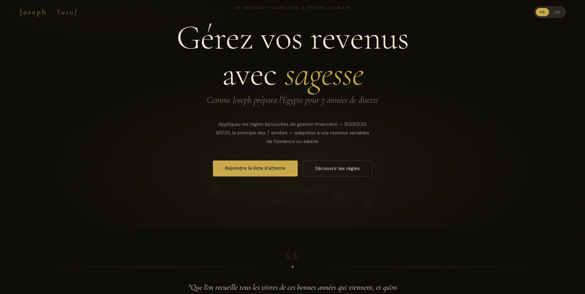
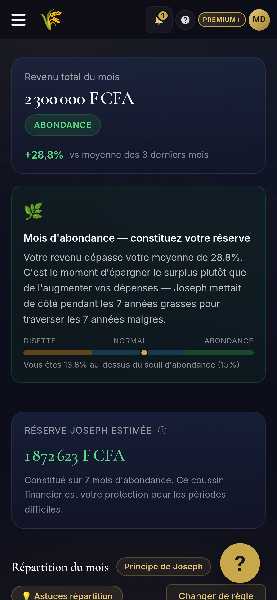
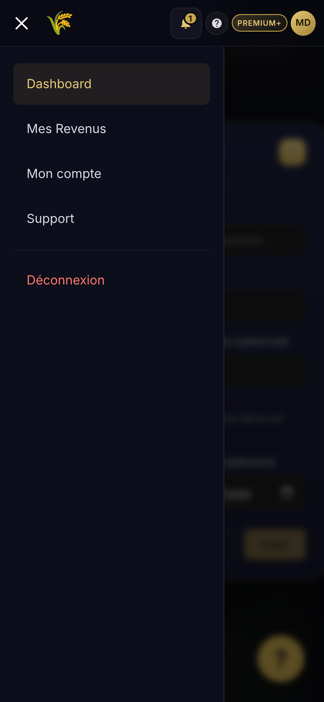

<p align="center">
  
</p>

<h1 align="center">Joseph·Yusuf</h1>

<p align="center">
  <em>SaaS de gestion des revenus pour freelances et salariés à revenus variables,
  basé sur le Principe biblique de Joseph : épargner pendant l'abondance,
  tenir pendant la disette.</em>
</p>

<p align="center">
  <a href="https://josephyusuf.com"></a>
  
  
  
  
</p>

---

## Démo

| Lien                                      | Compte                                                       |
|-------------------------------------------|--------------------------------------------------------------|
| https://josephyusuf.com                   | `demo.portfolio@josephyusuf.com` / *mot de passe sur demande* |
| https://admin.josephyusuf.com             | *réservé super-admin — non public*                            |

> Le compte démo est régénéré chaque nuit à 03h00 UTC
> (`scripts/reset-demo-account.sh`).

## Statut

> **En production publique** depuis le **23 mai 2026**.
> Stack complète déployée sur VPS Hetzner CPX32 derrière Nginx + Let's Encrypt.
> Monétisation Stripe / PayDunya / PayTech **en cours d'activation**
> (`PAYMENTS_ACTIVE=false` — les trials sont prolongés automatiquement
> jusqu'à finalisation du dashboard Stripe).

---

## Architecture

```
                                  ┌──────────────────────┐
                                  │   Nginx + Let's       │
   Internet  ────────► HTTPS ────►│   Encrypt (VPS)       │
                                  └──────────┬───────────┘
                                             │
                ┌────────────────────────────┼────────────────────────────┐
                ▼                            ▼                            ▼
        josephyusuf.com           api.josephyusuf.com         admin.josephyusuf.com
        (frontend SPA)            (gateway-service)           (admin-frontend SPA)
                                         │
                              Spring Cloud Gateway 8080
                                         │
              ┌──────────────────────────┼──────────────────────────┐
              ▼                          ▼                          ▼
       Eureka Discovery          ─── 8 microservices métier ───
       (discovery-server)             (lb:// routing)
                                         │
              ┌────────────┬────────────┼────────────┬────────────┬────────────┐
              ▼            ▼            ▼            ▼            ▼            ▼
        auth-service   income-svc  rule-engine   alert-svc   report-svc   subscription
              │            │            │            │            │            │
              └─── joseph_auth ─── joseph_income ─── joseph_alerts ─── ... ───┘
                                  (PostgreSQL multi-schema)
                                         │
                              Kafka (events)  +  Redis (cache)
```

## Microservices

| Service              | Port | Rôle                                                                       |
|----------------------|------|----------------------------------------------------------------------------|
| `discovery-server`   | 8761 | Registre Eureka (service discovery)                                        |
| `gateway-service`    | 8080 | API Gateway Spring Cloud, JWT relay, CORS, routes `/api/**`                |
| `auth-service`       | 8081 | Authentification JWT, plans FREE/PREMIUM/PREMIUM_PLUS, reset password      |
| `income-service`     | 8082 | Sources & revenus, classification Joseph (ABUNDANCE/LEAN/NORMAL), épargne  |
| `rule-engine-service`| 8083 | Règles financières (50/30/20, etc.) — pattern Strategy extensible          |
| `alert-service`      | 8084 | Alertes basées sur les événements Kafka (recommandations d'épargne)        |
| `report-service`     | 8085 | Rapports PDF mensuels (JasperReports)                                      |
| `subscription-service`|8086 | Abonnements Stripe + PayDunya + PayTech, webhooks, coupon `EARLY50`        |
| `admin-service`      | 8087 | Back-office : users, transactions, codes promo, KPIs, audit log            |
| `support-service`    | 8088 | Tickets support + base de connaissances FAQ, WebSocket notifications admin |

Plus 2 SPAs Angular : `frontend` (utilisateur) et `admin-frontend` (admin).

## Stack technique

**Backend** — Java 17 · Spring Boot 3.2.5 · Spring Cloud 2023.0.1
(Gateway + Eureka) · JJWT 0.12 · MapStruct 1.5 · Lombok · Flyway ·
PostgreSQL 15 (multi-schema) · Kafka 7.4 · Redis 7 · JasperReports ·
Spring Mail.

**Frontend** — Angular 17.3 (standalone components) · PrimeNG 17.18
(`lara-dark-amber`, accent gold `#C9A84C`) · Chart.js 4 · Stripe.js 9 ·
SheetJS (import Excel/CSV/JSON côté navigateur).

**Infrastructure** — Docker Compose · Ansible · Jenkins (multibranch +
PR pipeline) · SonarQube (Quality Gate bloquant sur new code) ·
Nginx + Let's Encrypt · VPS Hetzner CPX32 (Ubuntu 26.04).

## Logique métier — Principe de Joseph

Pour chaque mois, le revenu est classé en comparant à la moyenne
des 3 mois précédents :

```
ABUNDANCE  ⟵  revenu  >  moyenne × 1.15
NORMAL     ⟵  entre les deux
LEAN       ⟵  revenu  <  moyenne × 0.85
```

La recommandation d'épargne suit le statut :

```
ABUNDANCE  →  max(monthlyTarget, (revenu − moyenne) + 0.5 × monthlyTarget)
NORMAL     →  max(monthlyTarget, monthlyTargetPercent × revenu)
LEAN       →  0  (pause d'épargne)
```

La recommandation est répartie au prorata du restant à atteindre entre
les objectifs `ACTIVE`. Un événement Kafka `joseph.savings.recommendation`
est publié à chaque classification et consommé par l'`alert-service`
qui crée une alerte `SAVINGS_RECOMMENDATION` par utilisateur / mois /
objectif.

## Captures

<p align="center">
  
</p>

<p align="center">
  
  &nbsp;
  
</p>

## Démarrer en local

Prérequis : Docker ≥ 24, Docker Compose v2, Java 17, Maven, ~6 Go RAM libres.

```bash
git clone https://github.com/DedSlash/joseph-yusuf.git
cd joseph-yusuf

# 1. Préparer les variables d'environnement
cp .env.example .env
# Éditer .env :
#   - DB_PASSWORD = un nouveau mot de passe
#   - JWT_SECRET  = 64+ caractères aléatoires
#   - STRIPE_SECRET_KEY = sk_test_… (pour tester les paiements)

# 2. Build des microservices
mvn -DskipTests clean package

# 3. Lancer la stack
docker compose up -d --build

# 4. Vérifier l'état des services
docker compose ps
curl http://localhost:8080/actuator/health
```

Stack accessible à :

- Frontend       → http://localhost:4200
- Admin frontend → http://localhost:4201
- API Gateway    → http://localhost:8080
- Eureka         → http://localhost:8761

Guide pas-à-pas complet : [`docs/SMOKE-TEST.md`](docs/SMOKE-TEST.md).

## CI/CD

- `Jenkinsfile` — pipeline multibranch (build, tests, JaCoCo, SonarQube
  Quality Gate, build Docker, déploiement via Ansible).
- `Jenkinsfile.pr` — pipeline allégé pour les PR (build + tests + Sonar
  uniquement, pas de déploiement).
- `ansible/playbooks/` — `setup.yml`, `deploy.yml`, `deploy-all.yml`,
  `rollback.yml`.
- `scripts/deploy.sh` — déploiement rapide depuis la machine de dev.

## Documentation

- [`docs/SMOKE-TEST.md`](docs/SMOKE-TEST.md) — validation E2E complète
- [`docs/PAYMENT-INTEGRATION.md`](docs/PAYMENT-INTEGRATION.md) — flow Stripe + état Wave/Orange Money
- [`docs/JENKINS-SETUP.md`](docs/JENKINS-SETUP.md) — configuration Jenkins
- [`CONTRIBUTING.md`](CONTRIBUTING.md) — stratégie de branches Git

## Crédits

Conception, développement, déploiement : **Rey Dedy Pangou**
([@DedSlash](https://github.com/DedSlash)).

Stack assistée par **Claude Code** (Anthropic) pour la génération de
code, la revue et l'écriture des migrations / tests.

## License

**All rights reserved.** © 2026 Rey Dedy Pangou.

Ce dépôt est public à des fins de démonstration (portfolio). Le code
n'est pas distribué sous license open source : usage, copie,
modification ou redistribution ne sont **pas** autorisés sans accord
écrit explicite. Le contenu de `docs/` (hors captures) est consultable
à titre informatif.

Contact : [@DedSlash](https://github.com/DedSlash) ·
dedypangou@gmail.com
